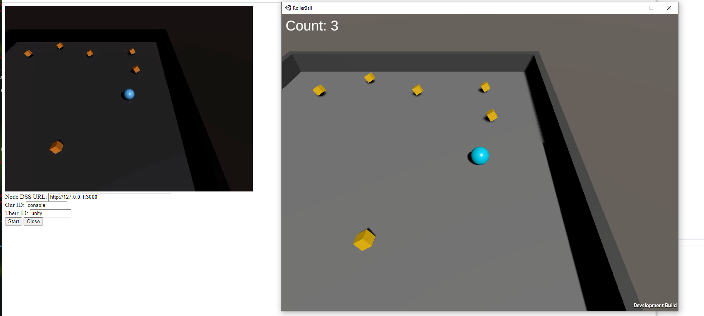

# Description

This example is based on the [Roll-a-Ball](https://learn.unity.com/project/roll-a-ball) tutorial. It adds the ability to receive the output from the Unity game player camera as a WebRTC video stream.

## Usage

1. Start [node-dss](https://github.com/bengreenier/node-dss) with `npm start`,

2. Run the Roller Ball game by pressing hte `Play` button in the Unity Editor. The C# script in the game should post an SDP offer to the `node-dss` server,

3. Execute the [WebRTCClient](https://github.com/sipsorcery/sipsorcery/tree/master/examples/WebRTCExamples/WebRTCClient) program. It will connect tot eh node-dss server, establish a WebRTC peer connection with the Unity game and then display the video stream from the duplicate game camera.

## Example

The screenshot below shows the game running in the Unity Editor and the same video source in a Windows Form after it has been transported over a WebRTC connection. 

In this case both programs are on the same machine but the point of using WebRTC is that the two programs could be anywhere on the Internet and still able to communicate.

Display in console:

Display in browser:

